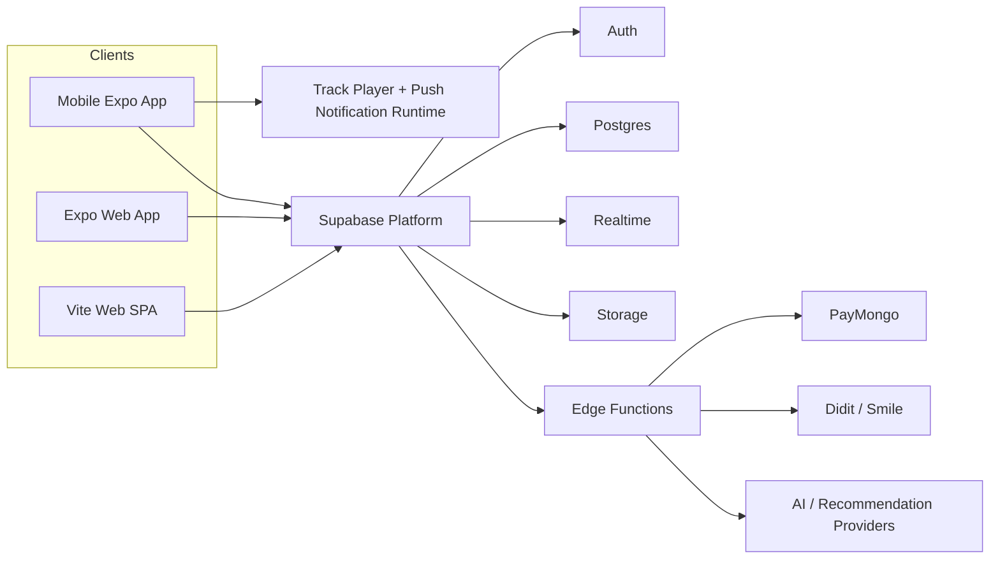

# MusikaLokal System Architecture

## 1. Executive Summary

MusikaLokal is a Supabase-centered multi-client product with three independent frontend shells:

- [mobile](mobile): the primary Expo / React Native app and the fastest-moving product surface.
- [web](web): an Expo Router web shell built on React Native Web, optimized for desktop layout and admin access.
- [web/web-app](web/web-app): a separate Vite + React SPA that still serves core Phase 1 workflows and an alternate admin entry point.

All three shells talk directly to the same backend platform through shell-local Supabase clients. There is no standalone Node, Express, or Nest server in this repository. Server-side logic lives in Supabase Edge Functions and Postgres.

Core platform services:

- Supabase Auth for identity, sessions, and token refresh
- Supabase Postgres for normalized product data and compatibility views
- Supabase Realtime for chat, presence, unread counts, and refresh signals
- Supabase Storage for media and document assets
- Supabase Edge Functions for privileged workflows, cross-table mutations, and external integrations

The dominant architecture style is:

- client-heavy UI and routing
- React Context plus local component state instead of a centralized store
- direct table or view reads for straightforward queries
- action-router Edge Functions for business workflows and privileged mutations
- parallel platform implementations across shells instead of a shared package

## 2. Repository Topology

| Path | Role | Notes |
| --- | --- | --- |
| [mobile](mobile) | Primary app shell | Fullest feature set, including social feed, radio playback, and marketplace browse |
| [web](web) | Expo web shell | Desktop-oriented subset plus the richest in-repo admin route surface |
| [web/web-app](web/web-app) | Separate Vite SPA | Alternate desktop shell for core workflows and admin |
| [mobile/supabase](mobile/supabase) | Primary backend workspace | Most complete function and migration inventory |
| [web/supabase](web/supabase) | Secondary backend workspace | Mirrors shared functions and adds admin-oriented functions |
| [docs](docs) | Product and implementation docs | Phase notes and feature rollout references |

This is not a monorepo with a shared domain package. Mobile and Expo web use similar folder shapes, but they keep separate implementations under their own [src](mobile/src) and [src](web/src) trees. The Vite app is fully separate again under [web/web-app/src](web/web-app/src).

Architecturally, that means MusikaLokal shares concepts and backend contracts across shells, but frontend logic can drift unless changes are applied in each shell explicitly.

## 3. System Context

High-level responsibility split:

- frontend shells own rendering, routing, client caching, local interaction state, and some recommendation shaping
- Supabase Auth owns session state and role identity
- Postgres owns transactional data, normalized relationships, and compatibility projections
- Edge Functions own privileged mutations, workflow orchestration, and third-party integrations
- Realtime provides live chat, presence, unread counters, and refresh triggers

## 4. Cross-Cutting Runtime Architecture

### Environment and configuration

- [mobile/app.config.js](mobile/app.config.js) injects Expo runtime config for the mobile shell.
- [web/app.config.js](web/app.config.js) does the same for the Expo web shell.
- [web/web-app/package.json](web/web-app/package.json) and the Vite config drive a separate web build pipeline.
- [mobile/supabase/config.toml](mobile/supabase/config.toml) and [web/supabase/config.toml](web/supabase/config.toml) show that backend development is maintained through two in-repo Supabase workspaces.

### Supabase client wrappers

Each shell has its own client wrapper:

- [mobile/lib/supabase.ts](mobile/lib/supabase.ts)
- [web/lib/supabase.ts](web/lib/supabase.ts)
- [web/web-app/src/lib/supabase.ts](web/web-app/src/lib/supabase.ts)

Those wrappers are not trivial SDK initializers. They all:

- persist auth state locally
- patch `supabase.functions` so every call uses a stable `FunctionsClient`
- inject Authorization headers when possible
- cache and refresh JWTs carefully
- retry some auth-related Edge Function failures in a controlled way

This wrapper layer is a meaningful architectural component because it standardizes how all shells talk to action-router Edge Functions.

### State management and provider topology

MusikaLokal uses React Context plus screen-local state rather than Redux, Zustand, or another global store.

Current provider stacks:

- Mobile in [mobile/app/_layout.tsx](mobile/app/_layout.tsx): `ThemeProvider -> TopToastProvider -> AuthProvider -> PortalProvider -> BottomSheetModalProvider -> BottomOverlayProvider -> RadioPlayerProvider`
- Expo web in [web/app/_layout.tsx](web/app/_layout.tsx): `ThemeProvider -> AuthProvider -> BottomSheetModalProvider`
- Vite web in [web/web-app/src/App.tsx](web/web-app/src/App.tsx): `BrowserRouter -> ThemeProvider -> AuthProvider`

Important implications:

- the mobile shell has extra runtime layers for toast delivery, bottom-sheet overlay coordination, and shared radio playback
- the Expo web shell does not mount the radio player or bottom overlay infrastructure
- the Vite shell is completely independent from the Expo trees at runtime

### Auth and policy gates

Auth state is not just signed-in versus signed-out. The auth contexts across shells track combinations of:

- guest mode
- role resolution and admin access
- identity-verification gating
- unpaid booking or system lock conditions
- presence lifecycle

That makes `AuthContext` the main policy gate for navigation and feature access across the repo.

### Realtime and notification model

Supabase Realtime is used directly from the clients for:

- conversation and message refresh
- user presence
- unread notification counts
- auth or profile refresh signals

The mobile shell adds a second notification path in [mobile/app/_layout.tsx](mobile/app/_layout.tsx): push registration plus live top-toast delivery and backfill. There is no custom websocket server and no separate notification microservice in the repo.

## 5. Client Shell Architecture

### 5.1 Mobile Expo App

Entry points:

- [mobile/app/_layout.tsx](mobile/app/_layout.tsx)
- [mobile/index.js](mobile/index.js)

The mobile app is the product reference shell. It contains the broadest route inventory under [mobile/app](mobile/app), including:

- auth, onboarding, and identity gates
- discovery and recommendations through `/home`
- the social home feed through `/feed`
- listing creation and management for gigs, groups, studios, and production surfaces
- unified activity in `/bookings`
- chat, notifications, wallet, and payment result flows
- production routes such as `/production_team` and `/my_production`
- playlists and radio routes such as `/create_playlist`, `/create_station`, `/playlist_details`, and `/station_details`
- marketplace routes such as `/marketplace`, `/seller_hub`, `/orders`, `/product_details`, and `/shop`

Important mobile-specific behavior:

- the bottom navbar in [mobile/src/components/navbar.tsx](mobile/src/components/navbar.tsx) routes Home to `/feed`, while `/home` remains the discovery and search hub
- deep-link handling for password recovery and payment redirects is centralized in the root layout
- the mobile shell wires push notifications and global toast delivery in the root layout
- UI composition is sheet-heavy and built around reusable components in [mobile/src/components](mobile/src/components)

#### Mobile unified activity model

[mobile/app/bookings.tsx](mobile/app/bookings.tsx) is no longer a narrow booking-status screen. It acts as a unified activity inbox that combines:

- booking lifecycle items
- production-team applications and invites
- commercial deal activity

This is an important architectural decision because multiple backend domains now converge on one user-facing operational surface.

#### Mobile radio and audio architecture

Radio playback is a mobile-only runtime concern today.

Core pieces:

- [mobile/src/context/RadioPlayerContext.tsx](mobile/src/context/RadioPlayerContext.tsx)
- [mobile/src/audio/radioTrackPlayer.ts](mobile/src/audio/radioTrackPlayer.ts)
- [mobile/src/audio/playbackService.ts](mobile/src/audio/playbackService.ts)
- [mobile/index.js](mobile/index.js)

Current behavior:

- playback state is centralized in `RadioPlayerProvider`
- a global mini-player is rendered from shared context rather than owned by route screens
- `react-native-track-player` is the primary playback engine when available
- `expo-av` remains as a fallback path inside the provider
- bottom-sheet overlap is coordinated through `BottomOverlayProvider`

This replaces the older mental model of route-local audio instances.

### 5.2 Expo Web App

Entry point:

- [web/app/_layout.tsx](web/app/_layout.tsx)

Primary shell components:

- [web/src/components/SidebarNav.web.tsx](web/src/components/SidebarNav.web.tsx)
- [web/app](web/app)
- [web/app/admin](web/app/admin)

The Expo web shell is desktop-oriented and shares many concepts with mobile, but it is no longer a full route mirror.

Current route coverage includes:

- Phase 1 core flows such as auth, account, discovery, bookings, manage, profile, notifications, wallet, and payment handling
- selected newer routes such as `deal_details`, `production_team`, `create_playlist`, `playlist_details`, `station_details`, `post_details`, `seller_hub`, `shop`, `orders`, and `product_details`
- admin routes under [web/app/admin](web/app/admin) including `index`, `permits`, `users`, `reports`, `audit`, `deals`, `posts`, and `products`

Important differences from mobile:

- there is no `/feed` route in [web/app](web/app)
- there is no `/marketplace` route in [web/app](web/app)
- there is no `/create_station` route in [web/app](web/app)
- the Expo web root layout does not mount `TopToastProvider`, `PortalProvider`, `BottomOverlayProvider`, or `RadioPlayerProvider`
- the sidebar home target in [web/src/components/SidebarNav.web.tsx](web/src/components/SidebarNav.web.tsx) remains `/home`

Architecturally, that means the Expo web shell supports core desktop workflows, selected Phase 2 detail and management screens, and the broadest admin UI, but it does not ship the full mobile social-feed and radio runtime stack.

### 5.3 Vite Web SPA

Entry points:

- [web/web-app/src/main.tsx](web/web-app/src/main.tsx)
- [web/web-app/src/App.tsx](web/web-app/src/App.tsx)

The Vite app is a separate React DOM application with its own:

- router
- auth context
- theme context
- Supabase client wrapper
- page tree under [web/web-app/src/pages](web/web-app/src/pages)

Current scope is narrower than the mobile shell and narrower than the Expo web admin shell. It covers:

- auth and account flows
- discovery and home
- bookings and manage flows
- chat, notifications, settings, and wallet
- listing CRUD and profile management
- admin dashboard access

What it does not currently expose:

- producer-network pages
- social feed home or post-management flows
- playlist or radio pages
- marketplace-specific browse and seller flows

Architecturally, the Vite app should be treated as an alternate desktop client for core workflows rather than a full product-surface twin of mobile.

## 6. Backend Architecture

### Backend style

Supabase Edge Functions are the application layer for server-side logic. The backend pattern is:

1. client calls an Edge Function or reads a table or view directly
2. function validates auth and input when the workflow is privileged or multi-step
3. function reads or writes normalized Postgres tables and returns a UI-friendly payload

There is no separate backend service in this repository beyond the Edge Function layer.

### Local Supabase workspaces

- [mobile/supabase/functions](mobile/supabase/functions) is the primary function workspace and contains the fullest product function inventory
- [mobile/supabase/migrations](mobile/supabase/migrations) contains the most complete migration timeline through the April 2026 feature work
- [web/supabase/functions](web/supabase/functions) mirrors many shared functions and adds admin-specific functions for the web shell
- [web/supabase/migrations](web/supabase/migrations) is a secondary migration history that overlaps heavily with, but is not identical to, the mobile workspace

That duplication is itself an architectural constraint: backend changes are not managed from one canonical package inside the repo.

### Edge Function domains

Representative function groups in [mobile/supabase/functions](mobile/supabase/functions):

- profile and account: `manage-profile`, `user-profile`, `delete-account`, `create-unverified-user`
- listings and discovery: `manage-details`, `manage-listings`, `listings-crud`, `search-content`
- bookings and applications: `manage-bookings`, `bookings-manage`, `gig-applications`, `group-members`
- notifications: `manage-notifications`
- payments and verification: `paymongo`, `withdrawals`, `create-didit-session`, `verify-identity`, `didit-webhook`, `smile-webhook`, `create-address-verification`
- AI and safety: `home-feed`, `instrument-suggestions`, `upload-safety-screen`
- storage lifecycle: `upload-file`, `setup-storage`, `delete-studio-with-storage`

Phase 2 feature routers:

- `manage-producer-network`: retired compatibility endpoint for older clients
- `manage-deals`: production teams and commercial deal workflows
- `manage-social-feed`: posts, follows, reactions, comments, and moderation flows
- `manage-playlists`: playlists, playlist items, stations, and station slots
- `manage-marketplace`: products, seller inventory, sold-state changes, and richer commerce actions

Admin-oriented functions in [web/supabase/functions](web/supabase/functions):

- `permit-management`
- `admin-users-management`
- `admin-reports-management`

### Edge Function design pattern

Many of the most important functions are action routers keyed by `body.action` instead of single-purpose endpoints. That pattern keeps client integration relatively uniform across shells, but it concentrates validation, authorization, and workflow branching inside large handlers.

This design is especially visible in:

- `manage-bookings`
- `manage-deals`
- `manage-details`
- `manage-marketplace`
- `manage-playlists`
- `manage-producer-network`
- `manage-social-feed`

### External integrations

The backend integrates with external services through Edge Functions rather than a separate integration service:

- PayMongo for payments and payout-related flows
- Didit and Smile for identity and address verification flows
- AI or recommendation services for `home-feed` and `instrument-suggestions`

## 7. Data Architecture

The migration history in [mobile/supabase/migrations](mobile/supabase/migrations) shows an increasingly normalized Postgres model with compatibility views and guardrails added during the 3NF migration series.

Major data domains:

- identity and verification: `profiles`, profile skill and genre tables, verification sessions, address verification sessions
- listings and review: `studios`, `gigs`, `groups`, related media and availability tables, favorites, reviews, and review interactions
- booking and wallet: `studio_bookings`, request and hold tables, attendance events, wallets, wallet transactions, wallet deposits, and withdrawal requests
- messaging and notifications: `conversations`, `conversation_participants`, `messages`, `message_reactions`, `notifications`, and notification preferences
- moderation and admin: `reports`, booking incidents, permit audit data, admin audit data, deletion audit tables, and penalties
- commercial and producer collaboration: production teams, direct connection requests, and deal tables
- social feed: follows, posts, media, reactions, and comments
- playlists and radio: playlists, playlist items, teaser assets, external links, stations, station playlist slots, and play-event tracking
- marketplace: products, variants, product media, orders, order items, fulfillments, shipping profiles, and user entitlements

Recent migration themes visible in the repo:

- February 2026: major 3NF expansion, backfill, dual-write, and legacy-column retirement work
- March 2026: permit review, studio or gig safety fixes, and booking lifecycle refinements
- April 2026: commercial booking tables, production-team connection flows, social feed tables, playlists and radio tables, marketplace tables, push notification delivery, and production-roster support in gig applications

The database is therefore not just a passive persistence layer. It carries compatibility rules, projection support, and evolving workflow primitives that the shells and Edge Functions both depend on.

## 8. Key End-to-End Flows

### Discovery and booking

Clients mix direct reads with detail and booking functions to browse listings, submit applications, and manage booking status. The mobile shell then folds those items into the unified `/bookings` activity model.

### Production team to commercial deal flow

Producer collaboration now starts from production teams and direct connection requests. Venue or recording negotiations then escalate into `manage-deals`, where production teams and deal terms are managed on the server side.

### Social feed to playlist and radio flow

The social graph and feed are driven by `manage-social-feed`. Playlist and station data are managed through `manage-playlists`. On mobile, playback is completed by the shared radio runtime, which turns station data into a live queue and background-capable player.

### Marketplace flow

The backend supports richer commerce primitives, but the mobile client currently uses a lighter chat-first marketplace experience for many user journeys. That means the data model is broader than the active mobile UX in some areas.

### Moderation and admin flow

Administrative operations are concentrated in the web shells, especially the Expo web admin routes and their supporting admin Edge Functions. Admin responsibilities now span permits, users, reports, audit data, deals, posts, and products.

## 9. Role-Based User Flows

The document now distinguishes between profile roles, entity types, and cross-role capabilities.

Current profile roles from the code and schema are:

- `musician`
- `studio-owner`
- `venue-owner`
- `producer`
- `admin`

There is also a `guest` mode in the client auth layer. Groups and duos are not separate user roles; they are managed entities that sit under musician or manager-style flows. Marketplace buyer or seller behavior is also a capability overlay, not a separate profile role.

### Role-to-page navigation summary

| Role | Primary shell landing or dashboard pages | Main interaction pages | Shell coverage notes |
| --- | --- | --- | --- |
| Guest | [mobile/app/index.tsx](mobile/app/index.tsx), [web/app/index.tsx](web/app/index.tsx), [web/web-app/src/pages/Login.tsx](web/web-app/src/pages/Login.tsx) | signup, recovery, legal, and payment-result pages | guest or unauthenticated flow exists in all three shells |
| Musician | [mobile/app/my_group.tsx](mobile/app/my_group.tsx), [web/app/my_group.tsx](web/app/my_group.tsx), [web/web-app/src/pages/MyGroup.tsx](web/web-app/src/pages/MyGroup.tsx) | bookings, chat, reviews, social, playlists, marketplace | mobile has the richest musician experience |
| Studio owner | [mobile/app/my_studio.tsx](mobile/app/my_studio.tsx), [web/app/my_studio.tsx](web/app/my_studio.tsx), [web/web-app/src/pages/MyStudio.tsx](web/web-app/src/pages/MyStudio.tsx) | studio CRUD, bookings, wallet, chat, reviews | supported across all three shells |
| Venue owner | [mobile/app/my_venue.tsx](mobile/app/my_venue.tsx), [web/app/my_venue.tsx](web/app/my_venue.tsx), [web/web-app/src/pages/MyVenue.tsx](web/web-app/src/pages/MyVenue.tsx) | gig CRUD, bookings, chat, deals, reviews | supported across all three shells, but mobile and Expo web have the broader deal and producer-adjacent surface |
| Producer | [mobile/app/my_production.tsx](mobile/app/my_production.tsx), [web/app/my_production.tsx](web/app/my_production.tsx) | production team, bookings, deals, chat | no dedicated producer shell exists yet in the Vite app |
| Admin | [web/app/admin/index.tsx](web/app/admin/index.tsx), [web/web-app/src/pages/AdminDashboard.tsx](web/web-app/src/pages/AdminDashboard.tsx) | permits, users, reports, audit, deals, posts, products | admin is effectively web-first; there is no dedicated mobile admin shell |

### Guest flow

Primary pages:

- Mobile auth entry: [mobile/app/index.tsx](mobile/app/index.tsx), [mobile/app/signup.tsx](mobile/app/signup.tsx), [mobile/app/forget_password.tsx](mobile/app/forget_password.tsx), [mobile/app/change_password.tsx](mobile/app/change_password.tsx), [mobile/app/terms_and_conditions.tsx](mobile/app/terms_and_conditions.tsx), [mobile/app/privacy_policy.tsx](mobile/app/privacy_policy.tsx), [mobile/app/payment-result.tsx](mobile/app/payment-result.tsx)
- Expo web auth entry: [web/app/index.tsx](web/app/index.tsx), [web/app/signup.tsx](web/app/signup.tsx), [web/app/forget_password.tsx](web/app/forget_password.tsx), [web/app/change_password.tsx](web/app/change_password.tsx), [web/app/terms_and_conditions.tsx](web/app/terms_and_conditions.tsx), [web/app/privacy_policy.tsx](web/app/privacy_policy.tsx), [web/app/payment-result.tsx](web/app/payment-result.tsx)
- Vite auth entry: [web/web-app/src/pages/Login.tsx](web/web-app/src/pages/Login.tsx), [web/web-app/src/pages/Signup.tsx](web/web-app/src/pages/Signup.tsx), [web/web-app/src/pages/ForgotPassword.tsx](web/web-app/src/pages/ForgotPassword.tsx), [web/web-app/src/pages/ChangePassword.tsx](web/web-app/src/pages/ChangePassword.tsx), [web/web-app/src/pages/TermsAndConditions.tsx](web/web-app/src/pages/TermsAndConditions.tsx), [web/web-app/src/pages/PrivacyPolicy.tsx](web/web-app/src/pages/PrivacyPolicy.tsx), [web/web-app/src/pages/PaymentResult.tsx](web/web-app/src/pages/PaymentResult.tsx)

Interaction model:

- guest or unauthenticated users do not have direct peer-to-peer flows yet; they are still in onboarding, recovery, or limited browse mode
- any attempt to move into bookings, chat, ownership dashboards, producer collaboration, or admin workflows is resolved by the shell `AuthContext` guards
- once guest mode is enabled in a shell, limited browsing can occur, but write-heavy and user-to-user surfaces remain gated

### Musician flow

Primary pages:

- Mobile discovery and identity: [mobile/app/feed.tsx](mobile/app/feed.tsx), [mobile/app/home.tsx](mobile/app/home.tsx), [mobile/app/profile.tsx](mobile/app/profile.tsx), [mobile/app/settings.tsx](mobile/app/settings.tsx), [mobile/app/account_details.tsx](mobile/app/account_details.tsx), [mobile/app/identity_verification.tsx](mobile/app/identity_verification.tsx)
- Mobile performer management: [mobile/app/my_group.tsx](mobile/app/my_group.tsx), [mobile/app/add_group.tsx](mobile/app/add_group.tsx), [mobile/app/add_duo.tsx](mobile/app/add_duo.tsx), [mobile/app/manage_group.tsx](mobile/app/manage_group.tsx), [mobile/app/edit_group.tsx](mobile/app/edit_group.tsx), [mobile/app/group_details.tsx](mobile/app/group_details.tsx)
- Mobile interaction and activity: [mobile/app/bookings.tsx](mobile/app/bookings.tsx), [mobile/app/chat.tsx](mobile/app/chat.tsx), [mobile/app/notifications.tsx](mobile/app/notifications.tsx), [mobile/app/submit_review.tsx](mobile/app/submit_review.tsx), [mobile/app/to_review.tsx](mobile/app/to_review.tsx)
- Mobile social and media pages: [mobile/app/post_details.tsx](mobile/app/post_details.tsx), [mobile/app/create_playlist.tsx](mobile/app/create_playlist.tsx), [mobile/app/create_station.tsx](mobile/app/create_station.tsx), [mobile/app/playlist_details.tsx](mobile/app/playlist_details.tsx), [mobile/app/station_details.tsx](mobile/app/station_details.tsx)
- Mobile marketplace overlay: [mobile/app/marketplace.tsx](mobile/app/marketplace.tsx), [mobile/app/shop.tsx](mobile/app/shop.tsx), [mobile/app/product_details.tsx](mobile/app/product_details.tsx), [mobile/app/orders.tsx](mobile/app/orders.tsx), [mobile/app/seller_hub.tsx](mobile/app/seller_hub.tsx)
- Expo web equivalents: [web/app/home.tsx](web/app/home.tsx), [web/app/discover.tsx](web/app/discover.tsx), [web/app/profile.tsx](web/app/profile.tsx), [web/app/my_group.tsx](web/app/my_group.tsx), [web/app/manage_group.tsx](web/app/manage_group.tsx), [web/app/group_details.tsx](web/app/group_details.tsx), [web/app/bookings.tsx](web/app/bookings.tsx), [web/app/chat.tsx](web/app/chat.tsx), [web/app/create_playlist.tsx](web/app/create_playlist.tsx), [web/app/playlist_details.tsx](web/app/playlist_details.tsx), [web/app/station_details.tsx](web/app/station_details.tsx), [web/app/product_details.tsx](web/app/product_details.tsx), [web/app/orders.tsx](web/app/orders.tsx), [web/app/seller_hub.tsx](web/app/seller_hub.tsx)
- Vite equivalents where present: [web/web-app/src/pages/Home.tsx](web/web-app/src/pages/Home.tsx), [web/web-app/src/pages/Discover.tsx](web/web-app/src/pages/Discover.tsx), [web/web-app/src/pages/Profile.tsx](web/web-app/src/pages/Profile.tsx), [web/web-app/src/pages/MyGroup.tsx](web/web-app/src/pages/MyGroup.tsx), [web/web-app/src/pages/ManageGroup.tsx](web/web-app/src/pages/ManageGroup.tsx), [web/web-app/src/pages/GroupDetails.tsx](web/web-app/src/pages/GroupDetails.tsx), [web/web-app/src/pages/Bookings.tsx](web/web-app/src/pages/Bookings.tsx), [web/web-app/src/pages/Chat.tsx](web/web-app/src/pages/Chat.tsx)

How musicians interact with other user types:

- with venue owners: they discover opportunities through discovery or listing surfaces, then the relationship moves into [mobile/app/bookings.tsx](mobile/app/bookings.tsx), [mobile/app/chat.tsx](mobile/app/chat.tsx), [mobile/app/submit_review.tsx](mobile/app/submit_review.tsx), and [mobile/app/to_review.tsx](mobile/app/to_review.tsx)
- with producers: they connect through production-team flows, then continue through [mobile/app/bookings.tsx](mobile/app/bookings.tsx), [mobile/app/chat.tsx](mobile/app/chat.tsx), and [mobile/app/notifications.tsx](mobile/app/notifications.tsx)
- with studio owners: studio discovery starts in browse or listing surfaces, while the operational relationship lands in [mobile/app/bookings.tsx](mobile/app/bookings.tsx), [mobile/app/chat.tsx](mobile/app/chat.tsx), [mobile/app/submit_review.tsx](mobile/app/submit_review.tsx), and [mobile/app/to_review.tsx](mobile/app/to_review.tsx)
- with other musicians: coordination happens through [mobile/app/my_group.tsx](mobile/app/my_group.tsx), [mobile/app/add_group.tsx](mobile/app/add_group.tsx), [mobile/app/add_duo.tsx](mobile/app/add_duo.tsx), [mobile/app/group_details.tsx](mobile/app/group_details.tsx), [mobile/app/feed.tsx](mobile/app/feed.tsx), playlists, radio pages, and chat

This role is also the most active participant in the social feed, playlists, radio listening, and follow graph surfaces.

### Studio-owner flow

Primary pages:

- Mobile: [mobile/app/my_studio.tsx](mobile/app/my_studio.tsx), [mobile/app/add_studio.tsx](mobile/app/add_studio.tsx), [mobile/app/manage_studio.tsx](mobile/app/manage_studio.tsx), [mobile/app/edit_studio.tsx](mobile/app/edit_studio.tsx), [mobile/app/bookings.tsx](mobile/app/bookings.tsx), [mobile/app/chat.tsx](mobile/app/chat.tsx), [mobile/app/wallet.tsx](mobile/app/wallet.tsx), [mobile/app/submit_review.tsx](mobile/app/submit_review.tsx), [mobile/app/to_review.tsx](mobile/app/to_review.tsx), [mobile/app/deal_details.tsx](mobile/app/deal_details.tsx)
- Expo web: [web/app/my_studio.tsx](web/app/my_studio.tsx), [web/app/add_studio.tsx](web/app/add_studio.tsx), [web/app/manage_studio.tsx](web/app/manage_studio.tsx), [web/app/edit_studio.tsx](web/app/edit_studio.tsx), [web/app/bookings.tsx](web/app/bookings.tsx), [web/app/chat.tsx](web/app/chat.tsx), [web/app/wallet.tsx](web/app/wallet.tsx), [web/app/deal_details.tsx](web/app/deal_details.tsx)
- Vite: [web/web-app/src/pages/MyStudio.tsx](web/web-app/src/pages/MyStudio.tsx), [web/web-app/src/pages/AddStudio.tsx](web/web-app/src/pages/AddStudio.tsx), [web/web-app/src/pages/ManageStudio.tsx](web/web-app/src/pages/ManageStudio.tsx), [web/web-app/src/pages/EditStudio.tsx](web/web-app/src/pages/EditStudio.tsx), [web/web-app/src/pages/Bookings.tsx](web/web-app/src/pages/Bookings.tsx), [web/web-app/src/pages/Chat.tsx](web/web-app/src/pages/Chat.tsx), [web/web-app/src/pages/Wallet.tsx](web/web-app/src/pages/Wallet.tsx)

How studio owners interact with other user types:

- with musicians and groups: they publish and manage inventory from the studio pages, while the active relationship moves into [mobile/app/bookings.tsx](mobile/app/bookings.tsx), [mobile/app/chat.tsx](mobile/app/chat.tsx), [mobile/app/submit_review.tsx](mobile/app/submit_review.tsx), and [mobile/app/to_review.tsx](mobile/app/to_review.tsx)
- with producers: when recording or commercial work is negotiated, the relationship can continue in [mobile/app/deal_details.tsx](mobile/app/deal_details.tsx) or [web/app/deal_details.tsx](web/app/deal_details.tsx)
- with admins: permit, report, or moderation outcomes are handled indirectly through web admin workflows rather than through a studio-owner dashboard

### Venue-owner flow

Primary pages:

- Mobile: [mobile/app/my_venue.tsx](mobile/app/my_venue.tsx), [mobile/app/add_gig.tsx](mobile/app/add_gig.tsx), [mobile/app/manage_gig.tsx](mobile/app/manage_gig.tsx), [mobile/app/edit_gig.tsx](mobile/app/edit_gig.tsx), [mobile/app/bookings.tsx](mobile/app/bookings.tsx), [mobile/app/chat.tsx](mobile/app/chat.tsx), [mobile/app/deal_details.tsx](mobile/app/deal_details.tsx), [mobile/app/notifications.tsx](mobile/app/notifications.tsx), [mobile/app/wallet.tsx](mobile/app/wallet.tsx)
- Expo web: [web/app/my_venue.tsx](web/app/my_venue.tsx), [web/app/add_gig.tsx](web/app/add_gig.tsx), [web/app/manage_gig.tsx](web/app/manage_gig.tsx), [web/app/edit_gig.tsx](web/app/edit_gig.tsx), [web/app/bookings.tsx](web/app/bookings.tsx), [web/app/chat.tsx](web/app/chat.tsx), [web/app/deal_details.tsx](web/app/deal_details.tsx), [web/app/notifications.tsx](web/app/notifications.tsx), [web/app/wallet.tsx](web/app/wallet.tsx)
- Vite: [web/web-app/src/pages/MyVenue.tsx](web/web-app/src/pages/MyVenue.tsx), [web/web-app/src/pages/AddGig.tsx](web/web-app/src/pages/AddGig.tsx), [web/web-app/src/pages/ManageGig.tsx](web/web-app/src/pages/ManageGig.tsx), [web/web-app/src/pages/EditGig.tsx](web/web-app/src/pages/EditGig.tsx), [web/web-app/src/pages/Bookings.tsx](web/web-app/src/pages/Bookings.tsx), [web/web-app/src/pages/Chat.tsx](web/web-app/src/pages/Chat.tsx), [web/web-app/src/pages/Wallet.tsx](web/web-app/src/pages/Wallet.tsx)

How venue owners interact with other user types:

- with musicians: venues publish gigs from their gig pages, receive direct applications in [mobile/app/bookings.tsx](mobile/app/bookings.tsx), and coordinate via [mobile/app/chat.tsx](mobile/app/chat.tsx), reviews, and notifications
- with groups and duos: the interaction follows the same page path as individual musician applications, but the candidate entity comes from group or duo-managed profiles
- with producers: venue owners can invite or evaluate production-routed applications from listing-detail and booking flows, then negotiate in [mobile/app/deal_details.tsx](mobile/app/deal_details.tsx) or [web/app/deal_details.tsx](web/app/deal_details.tsx)

This is the role where direct hiring and producer-mediated hiring converge into the same downstream review lifecycle.

### Producer flow

Primary pages:

- Mobile: [mobile/app/my_production.tsx](mobile/app/my_production.tsx), [mobile/app/add_production.tsx](mobile/app/add_production.tsx), [mobile/app/edit_production.tsx](mobile/app/edit_production.tsx), [mobile/app/production_team.tsx](mobile/app/production_team.tsx), [mobile/app/bookings.tsx](mobile/app/bookings.tsx), [mobile/app/deal_details.tsx](mobile/app/deal_details.tsx), [mobile/app/chat.tsx](mobile/app/chat.tsx), [mobile/app/notifications.tsx](mobile/app/notifications.tsx)
- Expo web: [web/app/my_production.tsx](web/app/my_production.tsx), [web/app/production_team.tsx](web/app/production_team.tsx), [web/app/bookings.tsx](web/app/bookings.tsx), [web/app/deal_details.tsx](web/app/deal_details.tsx), [web/app/chat.tsx](web/app/chat.tsx)
- Vite: no dedicated producer dashboard currently exists in [web/web-app/src/pages](web/web-app/src/pages)

How producers interact with other user types:

- with musicians: production-team connection requests move through [mobile/app/bookings.tsx](mobile/app/bookings.tsx), [mobile/app/chat.tsx](mobile/app/chat.tsx), and notifications
- with venue owners: producers represent a production team in venue-facing opportunities, then track approvals and negotiation in [mobile/app/bookings.tsx](mobile/app/bookings.tsx) and [mobile/app/deal_details.tsx](mobile/app/deal_details.tsx)
- with studio owners: when the relationship becomes a recording or commercial deal, the producer-side workflow also lands in the deal pages

This role acts as the coordination layer between talent discovery and venue-facing commercial work.

### Admin flow

Primary pages:

- Expo web admin shell: [web/app/admin/index.tsx](web/app/admin/index.tsx), [web/app/admin/permits.tsx](web/app/admin/permits.tsx), [web/app/admin/users.tsx](web/app/admin/users.tsx), [web/app/admin/reports.tsx](web/app/admin/reports.tsx), [web/app/admin/audit.tsx](web/app/admin/audit.tsx), [web/app/admin/deals.tsx](web/app/admin/deals.tsx), [web/app/admin/posts.tsx](web/app/admin/posts.tsx), [web/app/admin/products.tsx](web/app/admin/products.tsx)
- Vite admin shell: [web/web-app/src/pages/AdminDashboard.tsx](web/web-app/src/pages/AdminDashboard.tsx)
- Mobile: there is no dedicated mobile admin route set in [mobile/app](mobile/app)

How admins interact with other user types:

- admins do not participate as peer actors in booking or marketplace pages; they supervise those relationships through permits, reports, audit, deal, post, and product review screens
- admin actions affect every other role indirectly by changing moderation state, approval state, visibility, or enforcement state in the shared backend

### Cross-role capability overlays

Some user-facing flows cut across multiple profile roles instead of belonging to one role only.

Interaction pathways that matter architecturally:

- musician to venue owner: opportunity discovery starts in browse or listing surfaces, then moves into [mobile/app/bookings.tsx](mobile/app/bookings.tsx), [mobile/app/chat.tsx](mobile/app/chat.tsx), [mobile/app/submit_review.tsx](mobile/app/submit_review.tsx), and [mobile/app/to_review.tsx](mobile/app/to_review.tsx)
- musician to producer: collaboration starts with production-team connection flows, then continues in bookings, chat, and notifications
- musician or group to studio owner: discovery starts in browse or detail surfaces; scheduling, attendance, and review happen in bookings, chat, submit-review, and to-review pages
- buyer to seller: product discovery starts in [mobile/app/marketplace.tsx](mobile/app/marketplace.tsx), [mobile/app/shop.tsx](mobile/app/shop.tsx), and [mobile/app/product_details.tsx](mobile/app/product_details.tsx); negotiation typically continues in [mobile/app/chat.tsx](mobile/app/chat.tsx), while inventory control stays in [mobile/app/seller_hub.tsx](mobile/app/seller_hub.tsx) and [mobile/app/orders.tsx](mobile/app/orders.tsx)
- all signed-in roles to social and playlist features: mobile users primarily use [mobile/app/feed.tsx](mobile/app/feed.tsx), [mobile/app/post_details.tsx](mobile/app/post_details.tsx), [mobile/app/create_playlist.tsx](mobile/app/create_playlist.tsx), [mobile/app/playlist_details.tsx](mobile/app/playlist_details.tsx), [mobile/app/create_station.tsx](mobile/app/create_station.tsx), and [mobile/app/station_details.tsx](mobile/app/station_details.tsx)
- all roles to support surfaces: [mobile/app/chat.tsx](mobile/app/chat.tsx), [mobile/app/notifications.tsx](mobile/app/notifications.tsx), [mobile/app/wallet.tsx](mobile/app/wallet.tsx), [mobile/app/help_support.tsx](mobile/app/help_support.tsx), [mobile/app/account_details.tsx](mobile/app/account_details.tsx), and shell-equivalent web pages are reused across nearly every signed-in journey

## 10. Current Architectural Characteristics

Strengths:

- one backend platform serves all shells
- shell-local Supabase wrappers make function invocation behavior consistent
- mobile has a clear, rich product surface and the most complete runtime infrastructure
- realtime, notifications, deals, producer collaboration, and radio all build on the same platform primitives

Constraints and active architectural tradeoffs:

- there is no shared frontend package, so feature parity must be maintained manually across shells
- the repo contains two web delivery models, which increases scope management cost
- the backend is represented by two local Supabase workspaces, which introduces synchronization overhead
- action-router Edge Functions reduce endpoint sprawl but increase coupling and deployment sensitivity
- mobile is currently the most complete source of truth for Phase 2 product behavior; the web shells expose narrower or different slices of that surface

In practice, architecture discussions in this repo should start from [mobile](mobile) plus [mobile/supabase](mobile/supabase), then layer on [web](web) admin-specific behavior and [web/web-app](web/web-app) as an alternate, narrower client.
