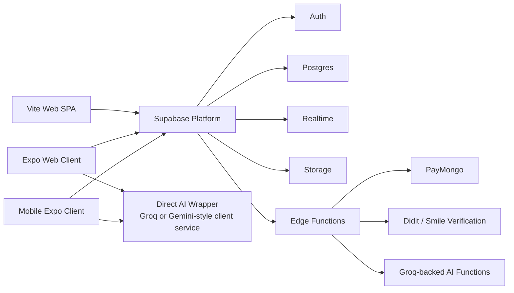
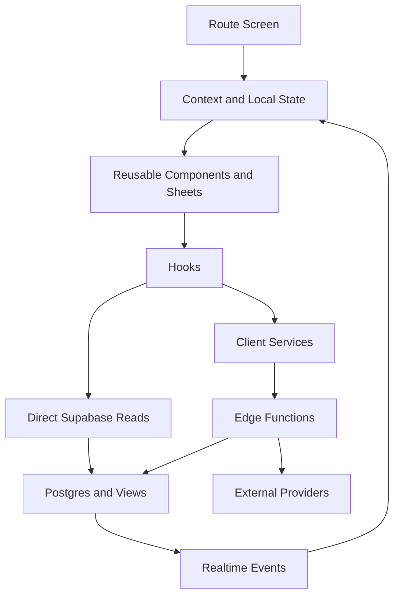
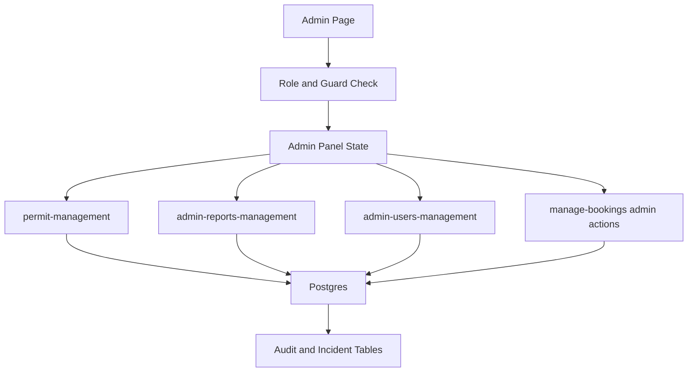

# MusikaLokal System Architecture

## 1. Executive Summary

MusikaLokal is organized as a client-heavy, Supabase-centered system with three frontend shells connected to one backend platform:

- [mobile](mobile) is the native-first Expo / React Native client.
- [web](web) is an Expo Router web client that mirrors much of the mobile experience with web-specific navigation and admin routes.
- [web/web-app](web/web-app) is a separate Vite + React SPA with overlapping product scope, including its own auth, navigation, and admin dashboard.

All three shells depend on a shared backend built on Supabase:

- Supabase Auth for identity and sessions
- Supabase Postgres for application data
- Supabase Realtime for presence, notifications, chat, and search refresh
- Supabase Edge Functions for privileged workflows and multi-table orchestration
- Supabase Storage helpers for uploads and deletion workflows

The dominant architecture style is:

- Frontend-driven UI and local state
- React Context for cross-cutting state
- Direct Supabase table and view reads for simple queries
- Action-based Edge Functions for business workflows and privileged mutations
- Realtime subscriptions instead of a separate message broker or websocket server

## 2. Repository Topology

### Top-level structure

- [mobile](mobile): Expo app for Android, iOS, and some shared React Native logic.
- [web](web): Expo web app using Expo Router and React Native Web.
- [web/web-app](web/web-app): Separate Vite application using React DOM and React Router.
- [mobile/supabase](mobile/supabase): Primary function and migration workspace for the shared backend.
- [web/supabase](web/supabase): Web-side function workspace that adds admin-focused functions and mirrors shared ones.
- [mobile/schema.sql](mobile/schema.sql), [mobile/supabase_schema.sql](mobile/supabase_schema.sql), [web/schema.sql](web/schema.sql): local schema references.

### Architectural implication

This repo does not use a true shared package for domain logic. Instead, mobile and web keep parallel source trees with similar folder shapes:

- [mobile/src](mobile/src)
- [web/src](web/src)

That means the platform shares concepts, backend contracts, and feature boundaries, but much of the implementation is duplicated rather than centrally packaged.

## 3. System Context

### Core platform responsibilities

- Frontends own presentation, routing, client-side caching, and most feature orchestration.
- Supabase Auth owns user sessions and token refresh.
- Postgres owns content, bookings, messaging, subscriptions, reporting, and admin audit trails.
- Edge Functions own privileged workflows, business rules spanning multiple tables, external API calls, and administrative actions.
- Realtime provides live notification counts, profile refresh triggers, messaging updates, and presence.

## 4. Cross-Cutting Runtime Architecture

### Environment loading

- [mobile/app.config.js](mobile/app.config.js) loads the root .env and injects Expo extra values.
- [web/app.config.js](web/app.config.js) does the same for the Expo web client.
- [web/web-app/vite.config.ts](web/web-app/vite.config.ts) uses the repo root as env source for the Vite app.

### Shared client infrastructure

- [mobile/lib/supabase.ts](mobile/lib/supabase.ts) and [web/lib/supabase.ts](web/lib/supabase.ts) create the Supabase client.
- Both clients persist sessions locally.
- Both patch Supabase Functions access to stabilize token handling and retries.
- Both centralize JWT refresh and cache behavior in the client layer.

### State management strategy

The codebase uses React Context plus local component state rather than Redux, Zustand, or another global store.

Main providers:

- [mobile/src/context/AuthContext.tsx](mobile/src/context/AuthContext.tsx)
- [web/src/context/AuthContext.tsx](web/src/context/AuthContext.tsx)
- [web/web-app/src/context/AuthContext.tsx](web/web-app/src/context/AuthContext.tsx)
- [mobile/src/context/ThemeContext.tsx](mobile/src/context/ThemeContext.tsx)
- [web/src/context/ThemeContext.tsx](web/src/context/ThemeContext.tsx)
- [mobile/src/context/TopToastContext.tsx](mobile/src/context/TopToastContext.tsx)

### Cross-cutting business gates

Auth state is more than signed-in versus signed-out. The main auth providers track:

- guest mode
- resolved role and admin status
- unpaid booking lock state
- subscription status and subscription-required gates
- identity verification status and identity-required gates
- presence channel lifecycle

This makes AuthContext the central policy gateway for navigation, guard behavior, and user-level feature access.

### Realtime pattern

Supabase Realtime is used directly from the clients for:

- notification inserts and unread counts in [mobile/app/_layout.tsx](mobile/app/_layout.tsx), [mobile/src/components/header.tsx](mobile/src/components/header.tsx), and [web/src/components/SidebarNav.web.tsx](web/src/components/SidebarNav.web.tsx)
- user presence tracking in [mobile/src/context/AuthContext.tsx](mobile/src/context/AuthContext.tsx), [web/src/context/AuthContext.tsx](web/src/context/AuthContext.tsx), [mobile/src/components/ChatScreen.tsx](mobile/src/components/ChatScreen.tsx), and [web/src/components/ChatScreen.tsx](web/src/components/ChatScreen.tsx)
- profile refresh subscriptions in the auth contexts
- conversation and message subscriptions in [mobile/src/hooks/useChat.ts](mobile/src/hooks/useChat.ts) and [web/src/hooks/useChat.ts](web/src/hooks/useChat.ts)
- search refresh subscriptions in [mobile/src/components/SearchBottomSheet.tsx](mobile/src/components/SearchBottomSheet.tsx) and [web/src/components/SearchBottomSheet.tsx](web/src/components/SearchBottomSheet.tsx)

There is no separate chat server or presence server in the repo.

## 5. Mobile Architecture

### Entry and shell

- Entry point: [mobile/app/_layout.tsx](mobile/app/_layout.tsx)
- Runtime stack: Expo Router, React Native, React Native Web compatibility, NativeWind, Expo modules
- Root providers: Gesture handler, theme, top toast, auth, bottom sheet modal provider

The mobile shell is responsible for:

- bootstrapping fonts and splash screen
- global deep-link handling for password recovery and payment redirects
- notification toast subscriptions
- identity and subscription gating before route access

### Route model

The mobile app uses file-based routing under [mobile/app](mobile/app).

Primary feature areas include:

- authentication and onboarding: [mobile/app/index.tsx](mobile/app/index.tsx), [mobile/app/signup.tsx](mobile/app/signup.tsx), [mobile/app/forget_password.tsx](mobile/app/forget_password.tsx), [mobile/app/change_password.tsx](mobile/app/change_password.tsx)
- discovery and home: [mobile/app/home.tsx](mobile/app/home.tsx), [mobile/app/feed.tsx](mobile/app/feed.tsx), [mobile/app/ai_suggestions.tsx](mobile/app/ai_suggestions.tsx)
- listings and ownership flows: [mobile/app/add_gig.tsx](mobile/app/add_gig.tsx), [mobile/app/add_studio.tsx](mobile/app/add_studio.tsx), [mobile/app/add_group.tsx](mobile/app/add_group.tsx), [mobile/app/manage_gig.tsx](mobile/app/manage_gig.tsx), [mobile/app/manage_studio.tsx](mobile/app/manage_studio.tsx), [mobile/app/manage_group.tsx](mobile/app/manage_group.tsx)
- bookings and wallet: [mobile/app/bookings.tsx](mobile/app/bookings.tsx), [mobile/app/wallet.tsx](mobile/app/wallet.tsx), [mobile/app/payment-result.tsx](mobile/app/payment-result.tsx)
- messaging and notifications: [mobile/app/chat.tsx](mobile/app/chat.tsx), [mobile/app/notifications.tsx](mobile/app/notifications.tsx)
- profile and policy screens: [mobile/app/profile.tsx](mobile/app/profile.tsx), [mobile/app/settings.tsx](mobile/app/settings.tsx), [mobile/app/account_details.tsx](mobile/app/account_details.tsx), [mobile/app/identity_verification.tsx](mobile/app/identity_verification.tsx)
- Phase 2 producer network: [mobile/app/producer_projects.tsx](mobile/app/producer_projects.tsx), [mobile/app/producer_project_details.tsx](mobile/app/producer_project_details.tsx)
- Phase 2 social feed: [mobile/app/post_details.tsx](mobile/app/post_details.tsx)
- Phase 2 playlists: [mobile/app/create_playlist.tsx](mobile/app/create_playlist.tsx), [mobile/app/playlist_details.tsx](mobile/app/playlist_details.tsx)
- Phase 2 marketplace: [mobile/app/seller_hub.tsx](mobile/app/seller_hub.tsx), [mobile/app/product_details.tsx](mobile/app/product_details.tsx), [mobile/app/orders.tsx](mobile/app/orders.tsx)

### Mobile composition model

The mobile UI is built around reusable, sheet-heavy components rather than page-specific monoliths.

Important examples:

- [mobile/src/components/ListingDetailsSheet.tsx](mobile/src/components/ListingDetailsSheet.tsx)
- [mobile/src/components/SearchBottomSheet.tsx](mobile/src/components/SearchBottomSheet.tsx)
- [mobile/src/components/RecentlyViewedSheet.tsx](mobile/src/components/RecentlyViewedSheet.tsx)
- [mobile/src/components/ChatScreen.tsx](mobile/src/components/ChatScreen.tsx)
- [mobile/src/components/InstrumentSuggestionSheet.tsx](mobile/src/components/InstrumentSuggestionSheet.tsx)

This gives the mobile app a layered presentation pattern:

- route screen as orchestration shell
- reusable screen furniture such as header and navbar
- modal and bottom-sheet components for detail and action flows
- hooks and services for backend communication

### Mobile data and service layer

The mobile client mixes direct table reads with Edge Function calls.

Direct client reads are used for:

- profiles and profile policy state
- conversations and participants
- messages and reactions
- some listing and favorites reads

Edge Functions are used for:

- profile mutations
- listing detail enrichment and favorite actions
- booking workflows
- address verification and identity verification
- payment initiation and wallet flows
- AI suggestion flows

Client-side service wrappers:

- [mobile/src/services/groqModelRouter.ts](mobile/src/services/groqModelRouter.ts): client-side AI orchestration, caching, home-feed reranking, instrument suggestion follow-up, and fallback handling
- [mobile/src/services/geminiFlashLite.ts](mobile/src/services/geminiFlashLite.ts): alternate AI client path
- [mobile/src/services/paymongo.ts](mobile/src/services/paymongo.ts): local PayMongo wrapper marked presentation-only
- [mobile/src/services/uploadSafetyScreen.ts](mobile/src/services/uploadSafetyScreen.ts): upload screening client wrapper

Supporting utilities:

- [mobile/src/utils/screenCache.ts](mobile/src/utils/screenCache.ts): screen cache used by chat and home flows
- [mobile/src/utils/offlineInstrumentRecommender.ts](mobile/src/utils/offlineInstrumentRecommender.ts): local fallback recommender

### Mobile chat architecture

Chat is implemented directly on Supabase tables and Realtime subscriptions.

Key building blocks:

- [mobile/src/hooks/useChat.ts](mobile/src/hooks/useChat.ts)
- [mobile/src/components/ChatScreen.tsx](mobile/src/components/ChatScreen.tsx)

Patterns used:

- one-to-one conversations created in the client by inserting into conversations plus conversation_participants
- group conversation bootstrapping through database-backed helpers referenced from the hook
- realtime channels for conversation-list refresh and per-conversation message streams
- local screen caching to reduce remount cost

### Mobile home and recommendation architecture

The home screen landscape changed in Phase 2. There are now two distinct home-area screens:

**feed.tsx — social home (primary landing page)**

[mobile/app/feed.tsx](mobile/app/feed.tsx) is the entry point when a user taps the Home tab in the bottom navbar. It implements a Facebook-style social home page with:

- a branded custom top bar (replaces the generic Header component) with notification and chat shortcuts
- an inline composer prompt row for quick post creation
- a horizontal shortcut row to Producer Projects, Shop, Playlists, Orders, and Seller Hub
- For You and Following feed tabs
- FlatList with infinite scroll pagination, pull-to-refresh, and optimistic reaction and follow toggles
- rich post cards: media grids, linked playlist and product tiles, reaction summary row, Like / Comment / Share action bar
- a Facebook-style create post modal with visibility control

The feed data is served by the `manage-social-feed` Edge Function (actions: `get_feed`, `create_post`, `react_to_post`, `remove_reaction`, `follow`, `unfollow`).

**home.tsx — marketplace discovery hub**

[mobile/app/home.tsx](mobile/app/home.tsx) remains the Explore / discovery entry point. It combines:

- direct content reads
- profile-signal extraction from skills and genres
- local ranking and type-balancing logic
- AI reranking through [mobile/src/services/groqModelRouter.ts](mobile/src/services/groqModelRouter.ts)
- cached results for fast remount behavior

This is not a purely backend-ranked feed. The client participates in recommendation shaping.

### Mobile-specific platform features

- deep linking through [mobile/app/_layout.tsx](mobile/app/_layout.tsx)
- Expo splash and font bootstrapping
- gesture-heavy interaction via bottom sheets and gesture handler
- AsyncStorage-backed auth and cache persistence
- top-level toast infrastructure in [mobile/src/context/TopToastContext.tsx](mobile/src/context/TopToastContext.tsx)

## 6. Web Architecture

The repo contains two separate web architectures.

## 6.1 Expo Web Client

### Entry and shell

- Entry point: [web/app/_layout.tsx](web/app/_layout.tsx)
- Runtime stack: Expo Router, React Native Web, NativeWind, shared Expo-compatible components

This shell mirrors the mobile app closely but adapts layout for desktop and larger screens:

- sidebar navigation through [web/src/components/SidebarNav.web.tsx](web/src/components/SidebarNav.web.tsx)
- responsive route composition and web-friendly list rendering in pages such as [web/app/home.tsx](web/app/home.tsx)
- admin route set under [web/app/admin](web/app/admin)

### Route model

Feature routes under [web/app](web/app) largely mirror the mobile surface:

- auth and account
- home, feed (social home), bookings, manage, profile, notifications, wallet
- listing creation and management
- AI suggestions
- verification and subscription flows
- Phase 2 producer network: producer_projects, producer_project_details
- Phase 2 social feed: post_details
- Phase 2 playlists: create_playlist, playlist_details
- Phase 2 marketplace: seller_hub, product_details, orders

Additional admin pages:

- [web/app/admin/index.tsx](web/app/admin/index.tsx)
- [web/app/admin/permits.tsx](web/app/admin/permits.tsx)
- [web/app/admin/users.tsx](web/app/admin/users.tsx)
- [web/app/admin/reports.tsx](web/app/admin/reports.tsx)
- [web/app/admin/audit.tsx](web/app/admin/audit.tsx)

Shared admin state and UI orchestration live in [web/app/admin/_AdminPanel.tsx](web/app/admin/_AdminPanel.tsx).

### Web Expo composition model

The Expo web client reuses the same architectural principles as mobile:

- file-based routes as orchestration shells
- component-driven feature composition
- shared AuthContext and ThemeContext policy gates
- direct Supabase reads mixed with action-based Edge Function calls

Key difference from mobile:

- the shell adapts into a desktop-oriented layout with sidebar navigation and larger responsive sections instead of mobile-first bottom navigation behavior.

### Feed-as-home routing (Phase 2)

Both shells now route the Home navigation item to `/feed` instead of `/home`:

- mobile navbar: [mobile/src/components/navbar.tsx](mobile/src/components/navbar.tsx) — Home tab href `/feed`, activeTab detection matches `feed|home`
- web sidebar: [web/src/components/SidebarNav.web.tsx](web/src/components/SidebarNav.web.tsx) — Home navItem href `/feed`, activeTab detection matches `feed|home`

`/home` remains accessible as the marketplace discovery hub (Explore / AI-ranked listings). The `home.tsx` Explore More shortcut section was updated to link to `/home` as "Discover" rather than `/feed`.

`match_inbox.tsx` was removed from both shells. Notification-style social matching surfaces are handled by the existing notifications page.

## 6.2 Vite Web SPA

### Entry and shell

- [web/web-app/src/main.tsx](web/web-app/src/main.tsx)
- [web/web-app/src/App.tsx](web/web-app/src/App.tsx)

This is a separate React DOM application with:

- BrowserRouter instead of Expo Router
- its own auth and theme contexts
- its own component and page tree under [web/web-app/src](web/web-app/src)
- a dedicated build pipeline in [web/web-app/package.json](web/web-app/package.json)

### Route model

The Vite app defines explicit routes for:

- public auth screens
- authenticated layout screens
- dedicated admin route guarded by role resolution

Representative pages:

- [web/web-app/src/pages/Home.tsx](web/web-app/src/pages/Home.tsx)
- [web/web-app/src/pages/Bookings.tsx](web/web-app/src/pages/Bookings.tsx)
- [web/web-app/src/pages/Wallet.tsx](web/web-app/src/pages/Wallet.tsx)
- [web/web-app/src/pages/AdminDashboard.tsx](web/web-app/src/pages/AdminDashboard.tsx)

### Architectural role of the Vite app

The nested Vite app appears to be a parallel web shell rather than a thin wrapper around the Expo web app.

Evidence:

- separate package.json and build output
- separate auth context and router
- duplicated page inventory
- separate admin dashboard implementation

From a system-architecture perspective, the repository currently supports two web delivery models over the same Supabase backend.

## 7. Shared Backend Architecture

### Backend style

There is no standalone Node or Nest backend in the repository. Supabase Edge Functions are the server-side application layer.

The backend pattern is:

- thin frontend invokes function with action payload
- function validates auth and input
- function reads and writes normalized Postgres tables and computed views
- function returns frontend-shaped payloads

### Core shared Edge Functions

Primary shared backend functions live in [mobile/supabase/functions](mobile/supabase/functions).

Important domains:

- profile and account: [mobile/supabase/functions/manage-profile](mobile/supabase/functions/manage-profile), [mobile/supabase/functions/user-profile](mobile/supabase/functions/user-profile), [mobile/supabase/functions/delete-account](mobile/supabase/functions/delete-account)
- listing and detail workflows: [mobile/supabase/functions/manage-details](mobile/supabase/functions/manage-details), [mobile/supabase/functions/manage-listings](mobile/supabase/functions/manage-listings), [mobile/supabase/functions/listings-crud](mobile/supabase/functions/listings-crud), [mobile/supabase/functions/search-content](mobile/supabase/functions/search-content)
- bookings and applications: [mobile/supabase/functions/manage-bookings](mobile/supabase/functions/manage-bookings), [mobile/supabase/functions/bookings-manage](mobile/supabase/functions/bookings-manage), [mobile/supabase/functions/gig-applications](mobile/supabase/functions/gig-applications), [mobile/supabase/functions/group-members](mobile/supabase/functions/group-members)
- notifications: [mobile/supabase/functions/manage-notifications](mobile/supabase/functions/manage-notifications)
- payments and wallet: [mobile/supabase/functions/paymongo](mobile/supabase/functions/paymongo), [mobile/supabase/functions/withdrawals](mobile/supabase/functions/withdrawals)
- verification and onboarding: [mobile/supabase/functions/create-didit-session](mobile/supabase/functions/create-didit-session), [mobile/supabase/functions/create-address-verification](mobile/supabase/functions/create-address-verification), [mobile/supabase/functions/verify-identity](mobile/supabase/functions/verify-identity), [mobile/supabase/functions/didit-webhook](mobile/supabase/functions/didit-webhook), [mobile/supabase/functions/verification-redirect](mobile/supabase/functions/verification-redirect), [mobile/supabase/functions/login-redirect](mobile/supabase/functions/login-redirect), [mobile/supabase/functions/create-unverified-user](mobile/supabase/functions/create-unverified-user)
- AI and recommendation: [mobile/supabase/functions/home-feed](mobile/supabase/functions/home-feed), [mobile/supabase/functions/instrument-suggestions](mobile/supabase/functions/instrument-suggestions), [mobile/supabase/functions/upload-safety-screen](mobile/supabase/functions/upload-safety-screen)
- storage lifecycle: [mobile/supabase/functions/upload-file](mobile/supabase/functions/upload-file), [mobile/supabase/functions/setup-storage](mobile/supabase/functions/setup-storage), [mobile/supabase/functions/delete-studio-with-storage](mobile/supabase/functions/delete-studio-with-storage)
- Phase 2 producer network: [mobile/supabase/functions/manage-producer-network](mobile/supabase/functions/manage-producer-network) — create/publish/archive projects, apply/review/withdraw applications, invite musicians, save talent, browse projects and match scores
- Phase 2 social feed: [mobile/supabase/functions/manage-social-feed](mobile/supabase/functions/manage-social-feed) — follow/unfollow, create/update/delete posts, get_feed (public + following), post reactions, comments, reporting, user post history
- Phase 2 playlists and radio: [mobile/supabase/functions/manage-playlists](mobile/supabase/functions/manage-playlists) — CRUD playlists, manage items and teaser assets, external links, record play events, CRUD radio stations and time-slot schedules
- Phase 2 marketplace: [mobile/supabase/functions/manage-marketplace](mobile/supabase/functions/manage-marketplace) — create/publish/update products, browse products, create/update orders, order status lifecycle, fulfillments, shipping profiles, seller dashboard metrics

### Web-only administrative backend additions

The web function workspace adds administrative services not present in the mobile function list:

- [web/supabase/functions/permit-management](web/supabase/functions/permit-management)
- [web/supabase/functions/admin-reports-management](web/supabase/functions/admin-reports-management)
- [web/supabase/functions/admin-users-management](web/supabase/functions/admin-users-management)

This means the admin architecture is currently web-centered at the backend layer, even though the broader product surface is cross-platform.

### Edge Function design pattern

Several functions are action routers rather than single-purpose handlers.

Examples:

- [mobile/supabase/functions/manage-profile/index.ts](mobile/supabase/functions/manage-profile/index.ts) routes create, fetch, update, and media actions
- [mobile/supabase/functions/manage-details/index.ts](mobile/supabase/functions/manage-details/index.ts) routes detail fetches, favorite toggles, and reporting actions
- [mobile/supabase/functions/manage-bookings/index.ts](mobile/supabase/functions/manage-bookings/index.ts) centralizes booking and incident logic
- [web/supabase/functions/permit-management/index.ts](web/supabase/functions/permit-management/index.ts) centralizes permit queue, metrics, audit, and review actions
- [web/supabase/functions/admin-reports-management/index.ts](web/supabase/functions/admin-reports-management/index.ts) centralizes report queue and moderation actions

This reduces endpoint count but increases function complexity and coupling.

### Backend read models and projections

The backend does not read only from raw tables. It also relies on computed views and projections, including:

- profiles_with_stats
- groups_with_stats
- studios_with_stats
- gigs_with_stats
- reviews_with_stats
- conversations_display_projection

These views allow the UI to fetch presentation-ready aggregates without duplicating every join in the client.

## 8. Data Architecture

The live public schema shows several domain clusters.

### Identity and profile domain

- profiles
- profile_skills
- profile_genres
- profile_portfolio_urls
- verification_sessions
- address_verification_sessions

This domain stores identity, profile metadata, verification state, and recommendation signals.

### Content and listing domain

- groups
- group_members
- group_media
- group_roster_members
- gigs
- gig_requirements
- gig_media
- gig_availability_slots
- studios
- studio_settings
- studio_operating_hours
- studio_date_overrides
- studio_amenities
- studio_types
- studio_media
- studio_instruments
- studio_availability_slots
- studio_open_dates
- favorites
- reviews
- review_likes
- review_comments

This domain models the marketplace inventory and the social proof around it.

### Booking and commercial domain

- studio_bookings
- booking_requests
- booking_holds
- booking_attendance_events
- gig_applications
- wallets
- wallet_transactions
- wallet_deposits
- payout_methods
- withdrawal_requests
- subscription_plans
- subscriptions
- subscription_payments

This domain handles booking lifecycle, revenue collection, balance tracking, and subscription monetization.

### Messaging and notification domain

- conversations
- conversation_participants
- messages
- message_reactions
- notifications
- notification_preferences

This domain powers 1:1 messaging, group messaging, presence-driven UX, and system notifications.

### Moderation, governance, and admin domain

- reports
- booking_incidents
- permit_audit_log
- admin_audit_log
- studio_deletion_audit
- gig_deletion_audit
- group_deletion_audit
- studio_owner_penalties

This is the control plane for content review, operational moderation, and incident resolution.

### Phase 2 producer network domain

- producer_projects
- producer_project_roles
- producer_project_applications
- producer_project_invites
- saved_talent

This domain powers the producer-to-musician matching and collaboration layer.

### Phase 2 social feed domain

- follows
- feed_posts
- post_media
- post_reactions
- post_comments

This domain powers the social graph, the ranked home feed, and post engagement. `follows` is a user-to-user edge table that also determines the "Following" feed filter in `manage-social-feed`.

### Phase 2 playlists and radio domain

- playlists
- playlist_items
- playlist_teaser_assets
- playlist_external_links
- radio_stations
- radio_station_slots
- play_events

This domain powers the teaser playlist product and the radio station scheduling layer. Playlists are linkable from feed posts and embeddable in marketplace products.

### Phase 2 marketplace domain

- products
- product_variants
- product_media
- marketplace_orders
- order_items
- order_fulfillments
- shipping_profiles
- digital_entitlements

This domain powers the merchandise and digital-drop commerce layer. Physical products have variant, stock, and shipping profile support. Digital products generate entitlements for gated-content access.

## 9. End-to-End Flow Architecture

## 9.1 Mobile and Expo Web request flow

Typical examples:

- booking actions from [mobile/app/bookings.tsx](mobile/app/bookings.tsx) and [web/app/bookings.tsx](web/app/bookings.tsx) invoke manage-bookings and related functions
- profile fetch and mutation from account pages invoke manage-profile
- detail pages invoke manage-details for enriched listing payloads and favorite behavior
- chat hooks read and write conversations directly, then subscribe to Realtime channels

## 9.2 Admin flow

Admin architecture is centered on web and currently couples dashboard metrics, moderation queues, incident handling, and audit data into a single admin control surface.

## 9.3 Recommendation and AI flow

There are two AI paths in the codebase:

- direct client-side AI wrapper calls in [mobile/src/services/groqModelRouter.ts](mobile/src/services/groqModelRouter.ts) and [web/src/services/groqModelRouter.ts](web/src/services/groqModelRouter.ts)
- backend AI calls in [mobile/supabase/functions/home-feed/index.ts](mobile/supabase/functions/home-feed/index.ts), [mobile/supabase/functions/instrument-suggestions/index.ts](mobile/supabase/functions/instrument-suggestions/index.ts), and [mobile/supabase/functions/upload-safety-screen/index.ts](mobile/supabase/functions/upload-safety-screen/index.ts)

This makes AI a hybrid architecture:

- frontend-managed prompt assembly, caching, and fallback behavior
- backend-managed AI for selected privileged or standardized workflows

## 10. Architectural Observations

### Strengths

- One shared backend platform supports all clients.
- Realtime is integrated cleanly for chat, notifications, and presence.
- Edge Functions are used where cross-table or privileged logic matters.
- AuthContext centralizes policy gates that would otherwise leak into many screens.
- Read models and projections reduce frontend join complexity.

### Structural tradeoffs

- Mobile and web duplicate a lot of domain code instead of sharing a package.
- The repo currently carries two web frontends with overlapping scope.
- Action-router Edge Functions are powerful but can become large and tightly coupled.
- AI integration is split across direct client calls and backend functions, which increases flexibility but also increases operational complexity.

### Current practical reading of the system

If you need to think about this codebase as one system, the cleanest mental model is:

- Product clients: mobile Expo app, Expo web app, and a parallel Vite SPA
- Shared control plane: Supabase Auth, Postgres, Realtime, Storage, Edge Functions
- Domain cores: marketplace listings, bookings, messaging, wallet and subscription payments, identity verification, moderation and admin
- Integration edges: PayMongo for payments, Didit and Smile webhooks for verification, Groq-backed AI for recommendation and screening

## 11. Expansion Roadmap

- roadmap index: [docs/implementation/README.md](docs/implementation/README.md)
- phase 1 spec: [docs/implementation/phase-1-commercial-booking.md](docs/implementation/phase-1-commercial-booking.md) — **delivered**
- phase 2 spec: [docs/implementation/phase-2-producer-social-media-marketplace.md](docs/implementation/phase-2-producer-social-media-marketplace.md) — **delivered**

### Phase 1 summary (delivered)

Added the commercial booking layer on top of the existing studio and gig listings: time-boxed holds, booking requests, payment-linked attendance events, booking incidents, payout-linked wallet transactions, and a per-profile unpaid-booking lock gate.

### Phase 2 summary (delivered)

Phase 2 added four new product domains managed by four new Edge Functions and four new migration files.

**Workstream A — Producer Network** (`manage-producer-network`)

Producers can create projects with structured roles, publish them for discovery, send direct invitations to musicians, and manage the full application and review lifecycle. Musicians browse published projects and apply. Both sides maintain a saved-talent list. Talent matching surfaces compatibility scores from profile skills/genres.

Key tables: `producer_projects`, `producer_project_roles`, `producer_project_applications`, `producer_project_invites`, `saved_talent`

**Workstream B — Social Feed** (`manage-social-feed`)

A user-to-user follow graph powers a ranked public feed. Posts can carry text, media, and linked entities (projects, playlists, products). Reactions, comments, and reporting are first-class surfaces. The feed is the primary home landing page in both mobile and web clients.

Key tables: `follows`, `feed_posts`, `post_media`, `post_reactions`, `post_comments`

**Workstream C — Playlists and Radio** (`manage-playlists`)

Musicians and producers create teaser playlists with tracks, cover art, and short preview clips. A radio station layer allows producers to build timed slot schedules from existing playlist items. Play events are recorded for analytics. Playlists are linkable from feed posts and embedded in product listings.

Key tables: `playlists`, `playlist_items`, `playlist_teaser_assets`, `playlist_external_links`, `radio_stations`, `radio_station_slots`, `play_events`

**Workstream D — Merchandise and Digital Marketplace** (`manage-marketplace`)

Sellers list physical merchandise and digital drops with variants, limited-edition flags, and per-product media. Buyers place orders through a wallet-backed checkout flow. Orders proceed through a fulfillment and shipping profile lifecycle. Digital purchases generate entitlements for gated content. A seller dashboard aggregates revenue and order metrics.

Key tables: `products`, `product_variants`, `product_media`, `marketplace_orders`, `order_items`, `order_fulfillments`, `shipping_profiles`, `digital_entitlements`
